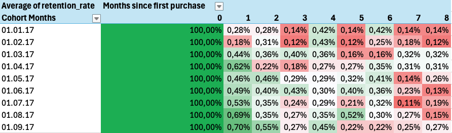
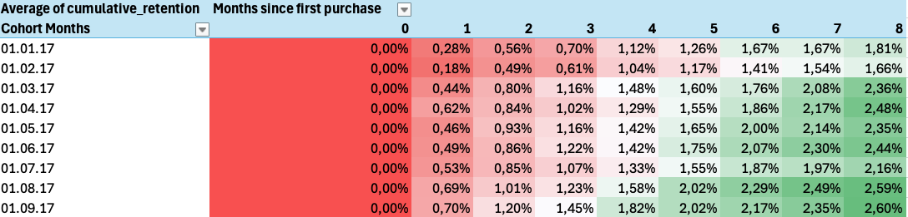
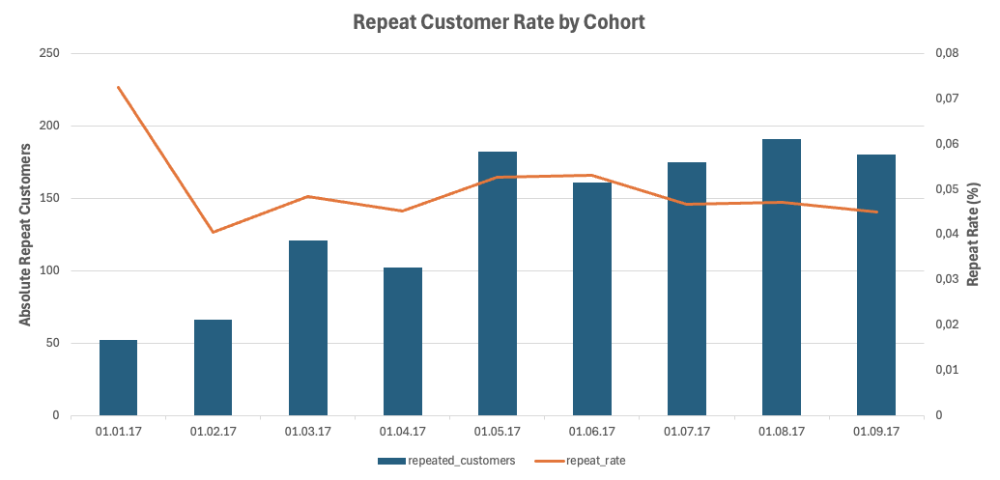

## Customer Retention

This analysis looks at how many customers make another purchase after their first order and how this behavior changes over time.

The heatmap shows for each cohort (month of first purchase) the percentage of customers who come back in the following months.

> For more details, see the [Excel file](analysis/excel/customer_retention.xlsx)

---

### Interpretation

At first glance, the heatmap shows that retention is very low overall. All values are below 1%, which means that only a very 
small number of customers make a second purchase.

It is noticeable that the highest values appear in the first two months after the first purchase. After that, retention drops 
or stays at a low level. This suggests that if customers come back, they usually do it quite early.

Over time, there is no clear trend. The values go up and down a bit, but there is no steady increase or sign of stronger 
customer loyalty. Customers do not become more loyal over time.

When comparing the different cohorts, they look very similar. There are no specific months that perform much better or 
worse than others. This indicates that the pattern is not related to a specific time period, but rather a general behavior.

Seasonal effects, such as a possible increase around Christmas, are not clearly visible in the data. Even if this would 
be expected, the effect is not strong enough to stand out in the retention values.

---

### Conclusion

Overall, the analysis shows very weak customer retention. Most customers only buy once, and repeat purchases mainly happen 
in the first months after the first order. After that, customer activity drops and there is no strong long-term engagement.

---

## Cumulative Retention

This analysis looks at how many customers come back at least once after their first purchase over time.

> For more details, see the [Excel file](analysis/excel/cumulative_retention.xlsx)

---

### Interpretation

At first glance, the heatmap shows that cumulative retention increases over time. This is expected, since the values 
are cumulative.

More important is not that the values increase, but how strongly they increase.

In the first months, the increase is still quite noticeable. After that, the growth clearly slows down. From around 
month 6 or 7, only small increases can be seen. This means that customers continue to return, but fewer new returners 
are added over time.

Overall, the level remains low. Even after several months, the share of returning customers is only around 2–2.6%. 
This shows that only a small part of customers come back at all.

When comparing the cohorts, they behave very similarly. There are no strong outliers or specific cohorts that perform 
much worse than others.

---

### Conclusion

The analysis shows that customers return continuously, but in very small numbers. Most returning customers come back 
in the first months after the initial purchase, and after that the growth slows down significantly.

Overall, there is no strong long-term effect, which points to weak customer retention.

--

## Repeat Customer Rate

This analysis looks at the share of customers who place more than one order.

> For more details, see the [Excel file](analysis/excel/repeat_customer_rate.xlsx)

---

### Data

| cohort_month | cohort_size | repeated_customers | repeat_rate |
|--------------|------------:|-------------------:|------------:|
| 2017-01-01   | 717         | 52                 | 0.072524    |
| 2017-02-01   | 1628        | 66                 | 0.040541    |
| 2017-03-01   | 2503        | 121                | 0.048342    |
| 2017-04-01   | 2256        | 102                | 0.045213    |
| 2017-05-01   | 3451        | 182                | 0.052738    |
| 2017-06-01   | 3037        | 161                | 0.053013    |
| 2017-07-01   | 3752        | 175                | 0.046642    |
| 2017-08-01   | 4057        | 191                | 0.047079    |
| 2017-09-01   | 4004        | 180                | 0.044955    |

---

### Interpretation

A first look at the values shows that the repeat rate is generally low. For most cohorts, it is around 4% to 5%, with 
a slightly higher value in the first cohort.

This means that only a small share of customers place more than one order.

Over time, there is no clear trend. The values stay relatively stable and only change slightly between the cohorts. 
There is no clear improvement or decline in customer retention.

It is noticeable that the number of customers increases in later cohorts. At the same time, the repeat rate stays at 
a similar level. This shows that more customers do not automatically lead to better retention.

The first cohort stands out a bit, but it does not reach a completely different level. Overall, the cohorts behave 
quite similarly.

---

### Conclusion

The analysis shows that customer retention is generally weak. Only a small share of customers place more than one order.

Even though the number of customers increases in later cohorts, the repeat rate remains mostly unchanged. This suggests 
that growth mainly comes from new customers, not from returning ones.
