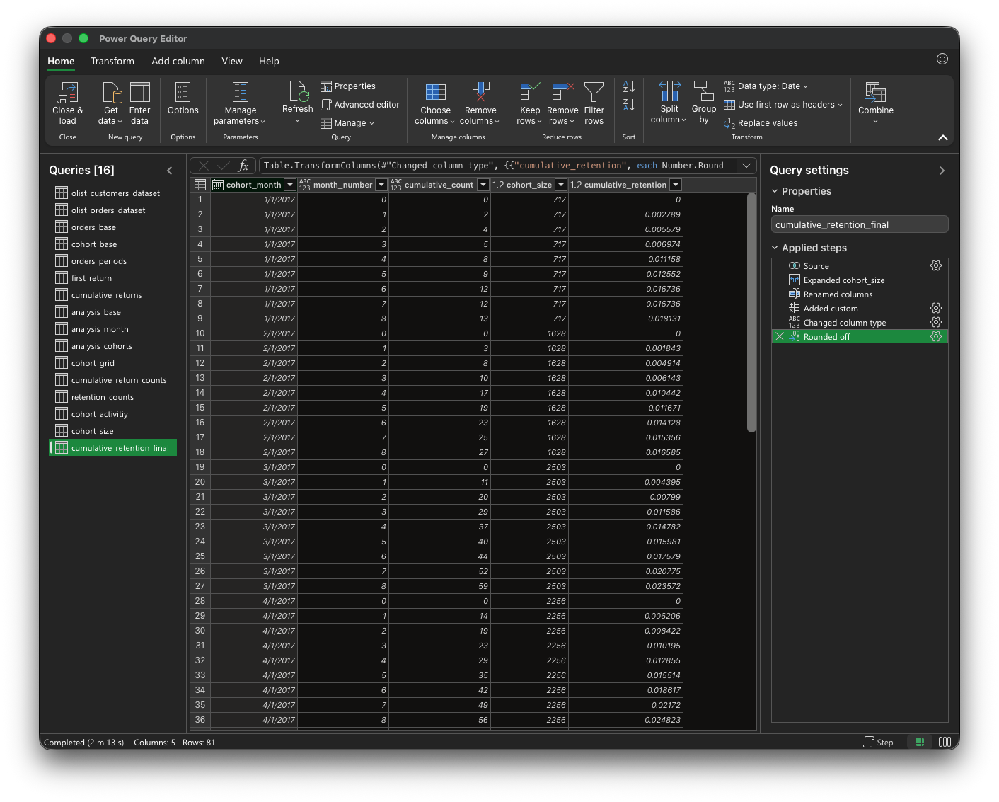

# Cumulative Retention

## Ziel

Ziel dieser Analyse ist es zu verstehen, wie viele Kunden nach ihrer ersten Bestellung mindestens einmal zurückkehren.

Im Gegensatz zur klassischen Retention wird nicht betrachtet, ob ein Kunde in einem bestimmten Monat aktiv ist, sondern:

> ob ein Kunde bis zu einem bestimmten Zeitpunkt mindestens einmal erneut gekauft hat

---

## Datengrundlage

Verwendet werden relevante CSV-Dateien aus dem Olist E-Commerce Datensatz, insbesondere:

- Bestellungen  
- Kunden  

Berücksichtigt werden ausschließlich Bestellungen mit:

- `order_status = 'delivered'`

Begründung:

Nur ausgelieferte Bestellungen stellen tatsächlich abgeschlossene Käufe dar.  
Andere Status (z. B. „canceled“) würden das Ergebnis verfälschen.

Analyseebene:

- `customer_unique_id` (repräsentiert den tatsächlichen Kunden über mehrere Bestellungen hinweg)

---

## Analysefenster

Die Analyse beschränkt sich auf Kohorten im Zeitraum:

- Januar 2017 bis September 2017

Beobachtungsdauer:

- 9 Monate (Month 0 bis Month 8)

Begründung:

Der Datensatz ist zeitlich begrenzt.  
Spätere Kohorten könnten nicht über denselben Zeitraum beobachtet werden.

Um eine vergleichbare Auswertung zu gewährleisten, wird daher ein einheitliches Beobachtungsfenster verwendet.

---

## Methodik

### Kohortendefinition und Zeitstruktur

Jeder Kunde wird anhand seines ersten Kaufs einer Kohorte zugeordnet:

- `cohort_month = Monat der ersten Bestellung`

Für jede Bestellung wird der Abstand zur ersten Bestellung berechnet:

- `month_number = Monate seit erster Bestellung`

---

### Bestimmung des ersten Wiederkaufs

Für jeden Kunden wird ermittelt, in welchem Monat nach Month 0 der erste erneute Kauf erfolgt.

Dabei werden nur Monate größer als 0 berücksichtigt.

---

### Kumulative Logik

Auf Basis dieses ersten Wiederkaufs wird berechnet, wie viele Kunden bis zu einem bestimmten Monat mindestens einmal zurückgekehrt sind.

Ein Kunde wird dabei nur einmal gezählt, basierend auf seinem ersten Wiederkauf.

Beispiel:

- Month 2 enthält alle Kunden mit erstem Wiederkauf in Month 1 oder Month 2  
- Month 3 enthält alle Kunden mit erstem Wiederkauf in Month 1, 2 oder 3  

---

## SQL-Validierung

Die Logik wurde zunächst in SQL umgesetzt und überprüft.

Zentrale Schritte:

- Bestimmung des ersten Wiederkaufs pro Kunde  
- Aggregation auf Kohortenebene  
- Berechnung kumulativer Werte über die Zeit  

SQL-Datei:

> [analysis/sql/cumulative_retention.sql](../analysis/sql/cumulative_retention.sql)

---

## Umsetzung in Power Query

Die gleiche Logik wurde anschließend in Power Query umgesetzt.

Im Vergleich zu SQL ergeben sich dabei zentrale Unterschiede.

SQL erlaubt:

- Window Functions  
- Join-Bedingungen wie `>=`  

Beides steht in Power Query nicht direkt zur Verfügung.

Die kumulative Logik wurde daher über einen Self Join umgesetzt.

Vorgehen:

- Self Join auf Kohortenebene  
- Vergleich der Monate über eine Custom Column (`>=`)  
- Filterung auf `TRUE`  
- anschließendes Gruppieren nach Kohorte und Monat  
- Zählung eindeutiger Kunden pro Gruppe  

So ergibt sich für jeden Monat die Anzahl der Kunden, die bis zu diesem Zeitpunkt mindestens einmal zurückgekehrt sind.

Excel-Datei:

> [analysis/excel/cumulative_retention.xlsx](../analysis/excel/cumulative_retention.xlsx)

---

## Ergebnisdaten

