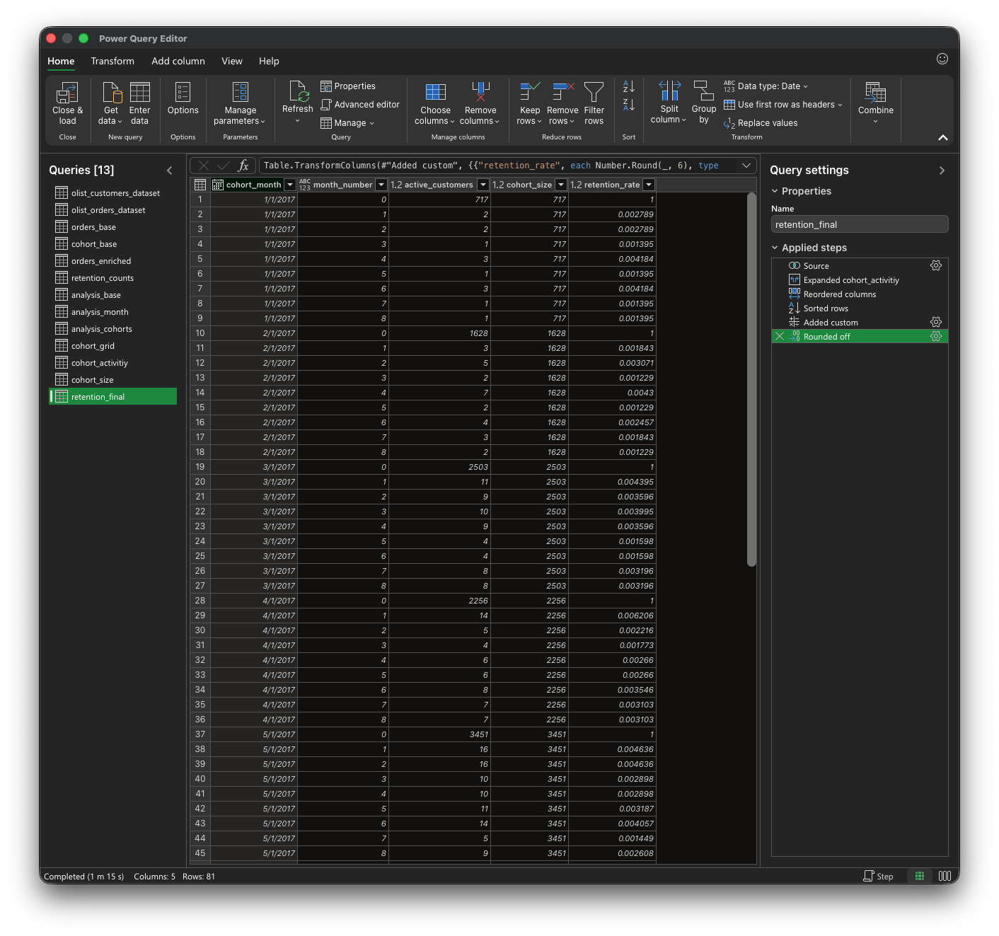

# Customer Retention

## Ziel

Ziel dieser Analyse ist es, das Wiederkaufsverhalten von Kunden über die Zeit zu untersuchen.

Konkret geht es um die Frage:

> Wie viele Kunden kaufen in den Monaten nach ihrer ersten Bestellung erneut?

---

## Datengrundlage

Verwendet werden relevante CSV-Dateien aus dem Olist E-Commerce Datensatz, insbesondere:

- Bestellungen  
- Kunden  

Berücksichtigt werden ausschließlich Bestellungen mit:

- `order_status = 'delivered'`

Begründung:

Nur ausgelieferte Bestellungen stellen tatsächlich abgeschlossene Käufe dar.  
Andere Status (z. B. „canceled“) würden das Bild verfälschen.

Analyseebene:

- `customer_unique_id` (repräsentiert den tatsächlichen Kunden über mehrere Bestellungen hinweg)

---

## Analysefenster

Die Analyse beschränkt sich auf Kohorten im Zeitraum:

- Januar 2017 bis September 2017

Beobachtungsdauer:

- 9 Monate (Month 0 bis Month 8)

Begründung:

Der Datensatz ist zeitlich begrenzt.  
Spätere Kohorten könnten nicht über denselben Zeitraum beobachtet werden.

Um die Kohorten sinnvoll vergleichen zu können, wird daher ein einheitliches Beobachtungsfenster verwendet.

---

## Methodik

### Kohortendefinition

Jeder Kunde wird anhand seines ersten Kaufs einer Kohorte zugeordnet:

- `cohort_month = Monat der ersten Bestellung`

---

### Zeitdimension

Für jede Bestellung wird der Abstand zur ersten Bestellung berechnet:

- `month_number = Monate seit erster Bestellung`

Dabei gilt:

- Month 0 = erste Bestellung  
- Month 1 = erster Folgemonat  
- usw.

---

### Retention-Definition

Retention misst:

> den Anteil der Kunden, die in einem bestimmten Monat erneut aktiv sind

Für jede Kombination aus:

- `cohort_month`  
- `month_number`  

wird gezählt, wie viele Kunden in diesem Monat mindestens eine Bestellung haben.

---

### Behandlung fehlender Monate

Es gibt Monate, in denen kein Kunde einer Kohorte eine Bestellung tätigt.

Diese Monate tauchen im Rohdatensatz nicht auf und müssen ergänzt werden, damit eine vollständige Zeitreihe entsteht.

Dazu wird eine Kombination aus:

- Kohorten  
- Monaten (0–8)  

erzeugt.

Fehlende Werte werden dabei als:

- `0` aktive Kunden  

interpretiert.

---

### Kennzahl

Die Retention Rate wird definiert als:

- aktive Kunden / Kohortengröße

Die Kohortengröße entspricht:

- Anzahl Kunden in Month 0

---

## SQL-Validierung

Die Logik wurde zunächst in SQL aufgebaut und geprüft.

Dabei wurden:

- die Kohorten bestimmt  
- die Monatsabstände berechnet  
- die Daten auf Kohorten- und Monatsebene aggregiert  
- fehlende Kombinationen ergänzt  
- und daraus die Retention Rate berechnet  

Die SQL-Variante dient als Referenz für die Umsetzung in Excel.

SQL-Datei: 

> [analysis/sql/customer_retention.sql](../analysis/sql/customer_retention.sql)

---

## Umsetzung in Power Query

Die gleiche Logik wurde anschließend in Power Query umgesetzt.

Im Vergleich zu SQL gibt es dabei einige Einschränkungen, insbesondere bei der Erzeugung der Zeitstruktur.

Für diese Analyse bedeutet das konkret:
 
- die Monate (0–8) wurden zunächst als eigene Tabelle erzeugt (über eine Zahlenliste in Power Query) 
- diese Monatstabelle wurde anschließend in die Kohorten-Tabelle eingebracht und expandiert, sodass für jede Kohorte eine Zeile pro Monat entsteht
- die Daten wurden in mehreren Schritten zusammengeführt  

Die Logik entspricht damit der SQL-Variante, die Umsetzung erfolgt jedoch mit den in Power Query verfügbaren Mitteln.

Excel-Datei:

> [analysis/excel/customer_retention.xlsx](../analysis/excel/customer_retention.xlsx)
---

## Ergebnisdaten

