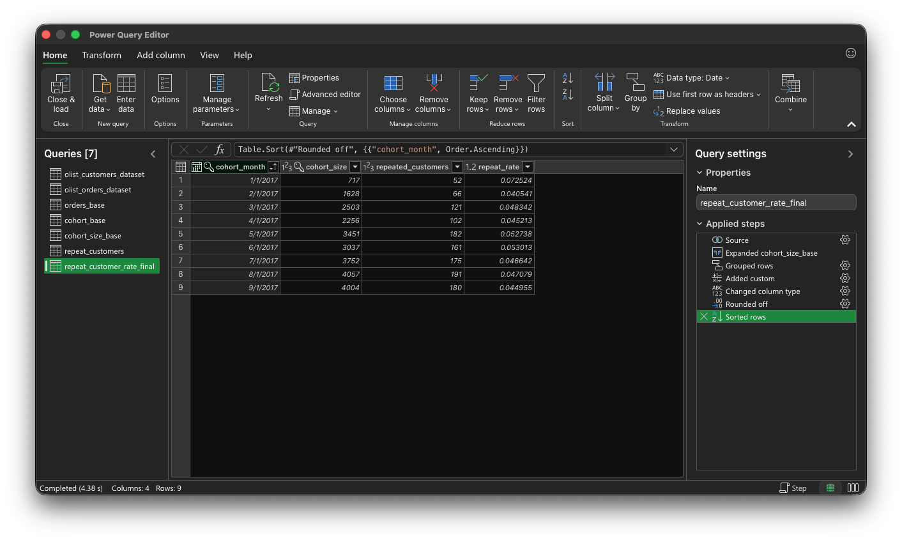

# Repeat Customer Rate

## Ziel

Ziel dieser Analyse ist es zu bestimmen, wie viele Kunden mehr als eine Bestellung tätigen.

Im Fokus steht die Frage:

> Wie hoch ist der Anteil der Kunden mit mehr als einer Bestellung?

---

## Datengrundlage

Verwendet werden relevante CSV-Dateien aus dem Olist E-Commerce Datensatz, insbesondere:

- Bestellungen  
- Kunden  

Berücksichtigt werden ausschließlich Bestellungen mit:

- `order_status = 'delivered'`

Begründung:

Nur ausgelieferte Bestellungen stellen tatsächlich abgeschlossene Käufe dar.  
Andere Status (z. B. „canceled“) würden das Ergebnis verfälschen.

Analyseebene:

- `customer_unique_id` (repräsentiert den tatsächlichen Kunden über mehrere Bestellungen hinweg)

---

## Analysefenster

Die Analyse beschränkt sich auf Kohorten im Zeitraum:

- Januar 2017 bis September 2017

Begründung:

Der Datensatz ist zeitlich begrenzt.  
Spätere Kohorten könnten nicht über denselben Zeitraum beobachtet werden.

Zur Sicherstellung der Vergleichbarkeit wird ein einheitliches Zeitfenster verwendet.

---

## Methodik

### Kohortendefinition

Jeder Kunde wird anhand seines ersten Kaufs einer Kohorte zugeordnet:

- `cohort_month = Monat der ersten Bestellung`

---

### Definition Repeat Customer

Ein Kunde gilt als Repeat Customer, wenn mehr als eine Bestellung vorliegt, unabhängig davon, ob die Folgebestellung im selben Monat erfolgt.

---

### Berechnung

Für jede Kohorte wird bestimmt:

- Anzahl aller Kunden  
- Anzahl der Kunden mit mehr als einer Bestellung  

Die Repeat Rate ergibt sich aus:

- Repeat Customers / Kohortengröße

---

## SQL-Validierung

Die Logik wurde zunächst in SQL umgesetzt und überprüft.

Zentrale Schritte:

- Bestimmung der Kohorten  
- Zählung der Bestellungen pro Kunde  
- Filterung auf Kunden mit mehr als einer Bestellung  
- Aggregation auf Kohortenebene  

SQL-Datei:

> [analysis/sql/repeat_customer_rate.sql](../analysis/sql/repeat_customer_rate.sql)

---

## Umsetzung in Power Query

Die gleiche Logik wurde anschließend in Power Query umgesetzt.

Im Vergleich zu SQL liegt der Unterschied hauptsächlich in der Filterung nach Aggregation.

SQL erlaubt:

- Filterung direkt über `HAVING count(*) > 1`

In Power Query erfolgt dies in zwei Schritten:

- Gruppierung nach Kunde und Kohorte zur Ermittlung der Bestellanzahl  
- anschließende Filterung auf Kunden mit mehr als einer Bestellung  

Erst danach wird auf Kohortenebene aggregiert.

Verknüpfungen erfolgen in mehreren Schritten, da Joins in Power Query jeweils nur zwischen zwei Tabellen möglich sind.

Excel-Datei:

> [analysis/excel/repeat_customer_rate.xlsx](../analysis/excel/repeat_customer_rate.xlsx) 

---

## Ergebnisdaten

